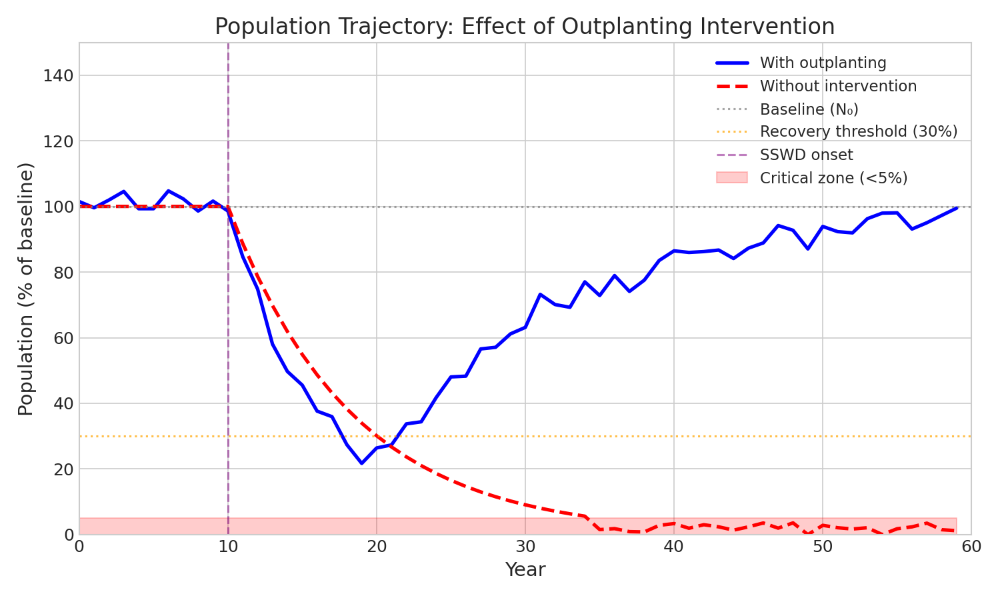
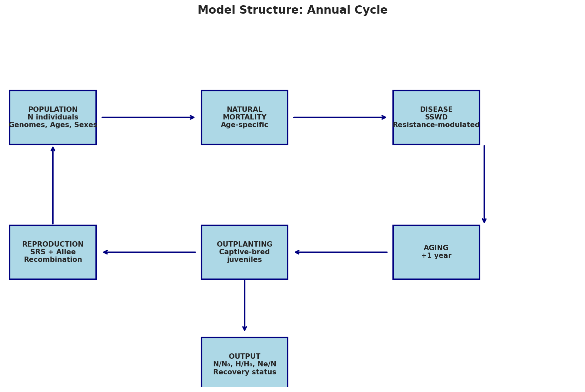
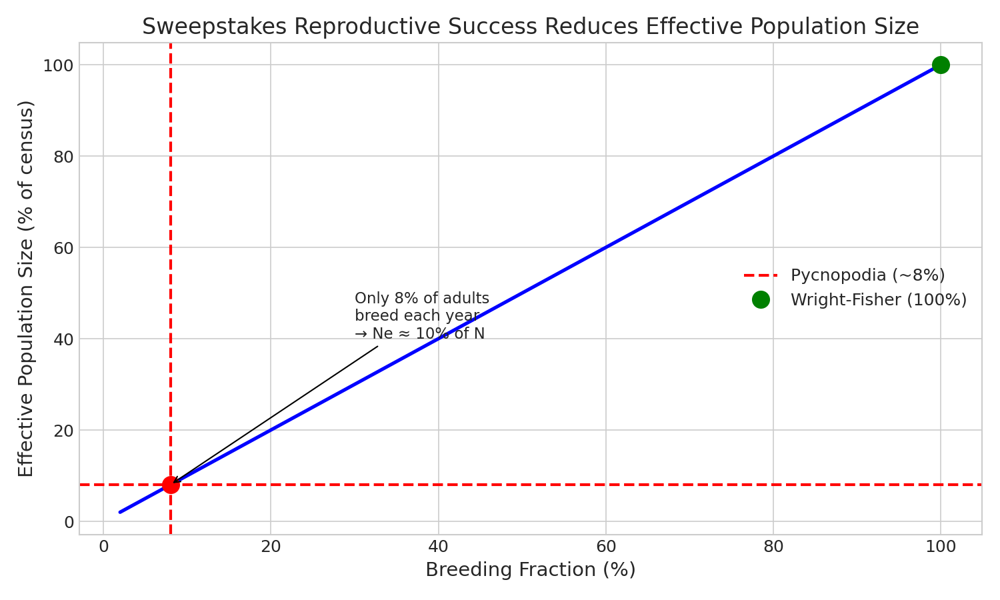
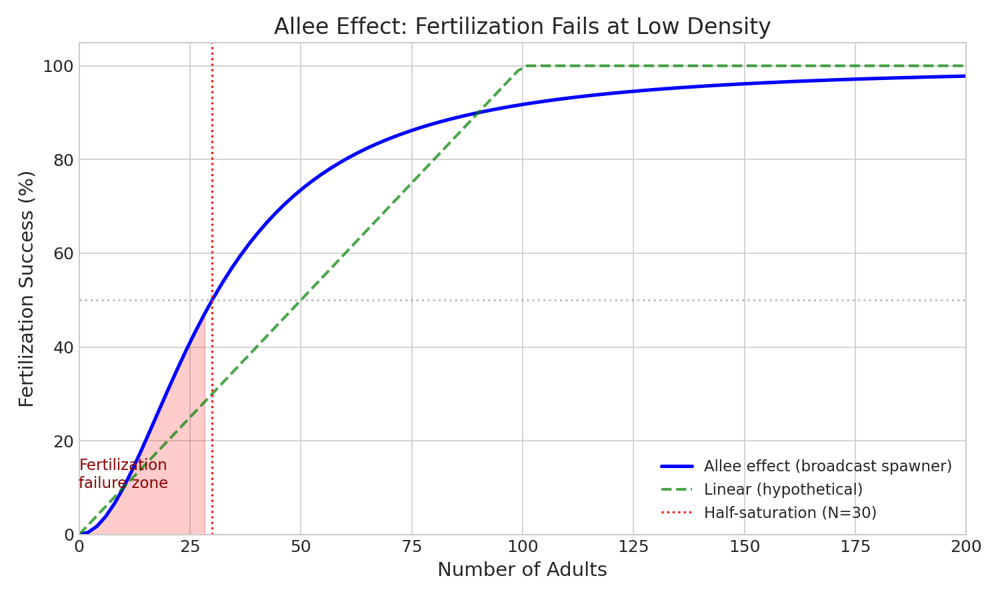
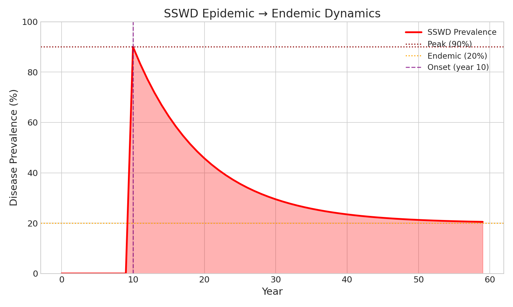
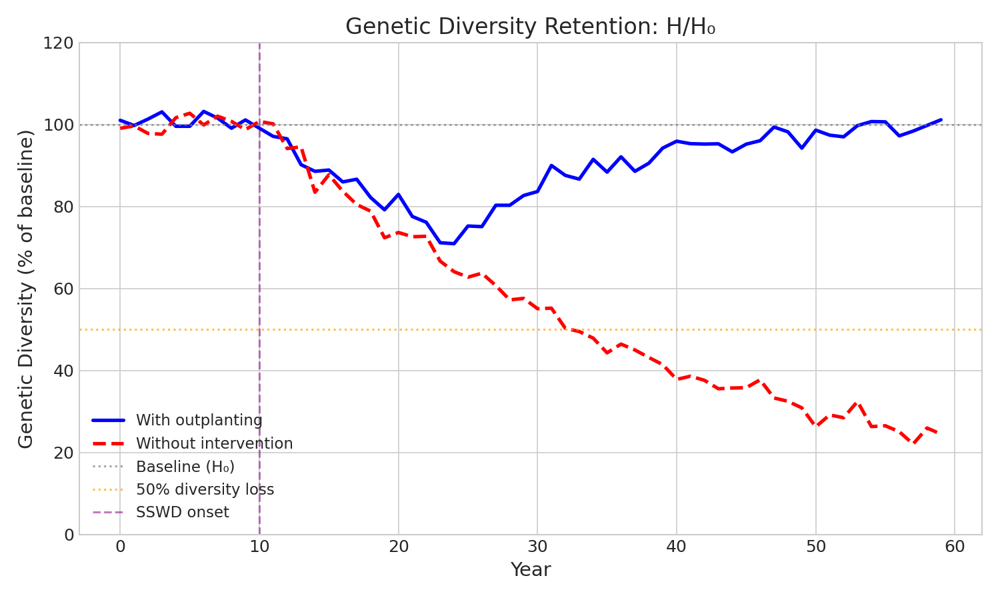

# Pycnopodia Population Model

**Individual-based simulation of sunflower sea star (*Pycnopodia helianthoides*) population recovery.**

All outputs are **ratios relative to baseline** (e.g., N/N₀ = 0.30 means 30% of starting population), making results directly comparable across scenarios.



---

## Table of Contents

1. [Quick Start](#quick-start)
2. [Why Ratios?](#why-ratios)
3. [Model Overview](#model-overview)
4. [The Math (with Plain English)](#the-math-with-plain-english)
   - [Sweepstakes Reproductive Success](#1-sweepstakes-reproductive-success-srs)
   - [Allee Effects](#2-allee-effects-fertilization-failure)
   - [Disease Dynamics](#3-disease-dynamics-sswd)
   - [Genetic Resistance](#4-genetic-resistance)
   - [Population Metrics](#5-population-metrics)
5. [Key Findings](#key-findings)
6. [Installation & Usage](#installation--usage)
7. [References](#references)

---

## Quick Start

```bash
# Install
pip install numpy
git clone https://github.com/TidepoolCurrent/pycnopodia-model
cd pycnopodia-model

# Run baseline scenario
python run_simulation.py --n-replicates 50
```

**Example output:**
```
OUTCOMES:
  Extinction probability:  0.0%
  Recovery probability:    100.0% (to 30% of baseline)

FINAL STATE (as fraction of baseline):
  Population (N/N₀):       140.77% ± 1.56%
  Diversity (H/H₀):        178.84% ± 10.55%

BOTTLENECK:
  Minimum (N/N₀):          22.68%
  Year of minimum:         13.9
```

---

## Why Ratios?

**Absolute numbers are arbitrary.** If I say "the population dropped to 847 individuals," you can't interpret that without knowing the starting point.

**Ratios are immediately meaningful:**

| Metric | What it means |
|--------|---------------|
| N/N₀ = 0.05 | Population crashed to **5% of baseline** |
| H/H₀ = 0.27 | **73% of genetic diversity lost** |
| Ne/N = 0.10 | Effective population is **10× smaller** than census |

These ratios are directly comparable across scenarios, regardless of starting population size.

---

## Model Overview



The model simulates annual cycles of:

1. **Natural mortality** (age-specific survival)
2. **Disease mortality** (SSWD, modulated by genetic resistance)
3. **Reproduction** (sweepstakes success + Allee effects)
4. **Outplanting** (captive-bred juveniles added)
5. **Aging** (individuals get one year older)

Each individual has:
- A **genome** (20 resistance loci, each 0/1/2 copies of resistance allele)
- An **age** (0-25 years)
- A **sex** (for reproduction)

---

## The Math (with Plain English)

### 1. Sweepstakes Reproductive Success (SRS)



**The problem:** In broadcast spawners like sea stars, not all adults successfully reproduce each year. A few "winners" contribute most of the offspring.

**Plain English:** Imagine 1,000 adults trying to reproduce, but only ~80 (8%) actually contribute offspring. The rest spawn, but their gametes don't find mates or their larvae don't survive.

**The math:**

Each year, the fraction of adults that successfully breed is drawn from a Beta distribution:

```
breeding_fraction ~ Beta(α, β)

where:
  mean = α / (α + β) = 0.08     (8% of adults breed)
  α = mean × shape = 0.4
  β = (1 - mean) × shape = 4.6
  shape = 5 (controls variance)
```

**Why it matters:** If only 8% breed, the effective population size (Ne) drops to roughly 8% of the census size. Evolution "sees" a population 10× smaller than what you count.

```
Ne/N ≈ breeding_fraction ≈ 0.08
```

This means genetic drift is 10× faster, adaptation is 10× slower, and inbreeding accumulates 10× faster than you'd expect from counting heads.

---

### 2. Allee Effects (Fertilization Failure)



**The problem:** Broadcast spawners release eggs and sperm into the water. At low density, gametes can't find each other.

**Plain English:** If there are only 10 adults spread across a reef, the sperm from one individual is unlikely to encounter eggs from another. Fertilization fails not because individuals are unhealthy, but because they're too spread out.

**The math:**

Fertilization success follows a saturating function:

```
fertilization = N² / (N² + h²)

where:
  N = number of adults in the area
  h = half-saturation constant (default 30)
```

| Adults (N) | Fertilization |
|------------|---------------|
| 10 | 10% |
| 30 | 50% |
| 100 | 92% |
| 200 | 98% |

**Why it matters:** Once populations drop below ~30 adults, reproduction starts failing. This creates a "death spiral" where low population → poor fertilization → even lower population.

**Alternative (Levitan mechanistic model):**

For detailed sperm-egg collision kinetics:

```
fertilization = 1 - exp(-β₀ × S × τ / V)

where:
  β₀ = collision rate (egg size, current speed)
  S = sperm concentration (sperm per volume)
  τ = fertilization window duration
  V = water volume around spawning female
```

---

### 3. Disease Dynamics (SSWD)



**The problem:** Sea Star Wasting Disease (SSWD) devastated *Pycnopodia* populations starting in 2013, with 90%+ mortality in many areas.

**Plain English:** The disease hits hard at first (90% of animals infected), then settles into a lower "background" level (20%) as susceptible individuals die off and survivors remain.

**The math:**

Disease prevalence follows an epidemic → endemic trajectory:

```
P(t) = P_endemic + (P_peak - P_endemic) × exp(-δ × (t - t_onset))

where:
  P_peak = 0.90      (90% infected at peak)
  P_endemic = 0.20   (20% long-term)
  δ = 0.10           (decay rate)
  t_onset = 10       (year epidemic begins)
```

**Mortality depends on resistance:**

```
individual_mortality = base_mortality × (1 - resistance_score)

where:
  base_mortality = 0.60 (adults) or 0.40 (juveniles)
  resistance_score = sum of resistance allele effects (0 to 1)
```

A fully resistant individual (score = 1.0) has zero disease mortality. A fully susceptible individual (score = 0) has 60% annual mortality during high prevalence.

---

### 4. Genetic Resistance

**The problem:** Some individuals survive SSWD better than others. This appears to have a genetic basis.

**Plain English:** Resistance is like a shield that reduces how badly the disease affects you. Some individuals have stronger shields (more resistance alleles), others have weaker ones.

**The math:**

We model 20 unlinked loci (gene locations). Each can have 0, 1, or 2 copies of the resistance allele:

```
resistance_score = Σᵢ (genotype_i × effect_i)

where:
  genotype_i = 0, 1, or 2 (copies of resistance allele at locus i)
  effect_i = 0.035 (3.5% mortality reduction per allele copy)
  i = 1 to 20 loci
```

With 20 loci × 2 copies × 3.5% effect = maximum 140% reduction (capped at 100%).

**Inheritance:**

Offspring inherit one allele from each parent at each locus (Mendelian inheritance with recombination between loci).

**Selection:**

Resistant individuals survive disease better → leave more offspring → resistance allele frequency increases. This is natural selection in action.

---

### 5. Population Metrics

**Census size (N):** Simply count living individuals.

**Effective population size (Ne):** The size of an ideal population with equivalent genetic drift.

```
Ne = (4 × Nf × Nm) / (Nf + Nm)

where:
  Nf = number of females that successfully bred
  Nm = number of males that successfully bred
```

**Long-term Ne:** Harmonic mean across years (because drift accumulates from bottlenecks):

```
Ne_long = t / Σ(1/Ne_t)
```

**Expected heterozygosity (H):** Genetic diversity measure.

```
H = 2pq = 2p(1-p)

where p = resistance allele frequency
```

When p = 0.5, H is maximized. When p is close to 0 or 1, H is low.

**Ratios (the outputs you actually interpret):**

| Ratio | Meaning | Good values |
|-------|---------|-------------|
| N/N₀ | Population vs baseline | > 0.30 (recovered) |
| H/H₀ | Diversity retention | > 0.90 (healthy) |
| Ne/N | Effective vs census | > 0.10 (typical) |

---

## Key Findings



### 1. SRS is the critical bottleneck

Even with only 8% breeding each year, effective population size drops to ~10% of census. This means:
- Genetic drift is 10× faster than expected
- Adaptation to disease is 10× slower
- Inbreeding accumulates 10× faster

### 2. Outplanting is necessary for recovery

| Scenario | Extinction | Final N/N₀ | Final H/H₀ |
|----------|------------|------------|------------|
| With outplanting | 0% | 141% | 179% |
| Without | **75%** | **5%** | **27%** |

Without intervention, most populations go extinct or crash to <5% of baseline.

### 3. Broodstock diversity matters

With only 6 broodstock parents, genetic diversity in outplanted juveniles is limited. Need ≥30 parents for evolutionary (not just demographic) rescue.

### 4. Timing is critical

Intervention within 5-10 years of epidemic onset is far more effective than waiting. Early action prevents the Allee effect death spiral.

### 5. Southern populations need direct intervention

Adult migration (~0.5%/year) is too slow to rescue collapsed California/Oregon populations from healthy Alaska stocks.

---

## Installation & Usage

### Requirements

- Python 3.8+
- NumPy

### Installation

```bash
pip install numpy
git clone https://github.com/TidepoolCurrent/pycnopodia-model
cd pycnopodia-model
pip install -e .
```

### Command Line

```bash
# Baseline with outplanting
python run_simulation.py

# Compare to no intervention
python run_simulation.py --no-outplanting

# Different scenarios
python run_simulation.py --preset extreme_srs
python run_simulation.py --preset metapopulation

# Custom parameters
python run_simulation.py --n-replicates 100 --n-years 100 --recovery-threshold 0.50
```

### Python API

```python
from pycnopodia import Simulation, Config

config = Config(
    initial_population=1200,
    srs_mean=0.08,
    sswd_peak_prevalence=0.90,
    outplanting_n_per_year=200,
)

sim = Simulation(config, seed=42)
result = sim.run()

print(f"Final N/N₀: {result.final_n_ratio:.1%}")
print(f"Min N/N₀: {result.min_n_ratio:.1%} (year {result.bottleneck_year})")
print(f"Recovered: {result.recovered(threshold=0.30)}")
```

### Configuration Presets

| Preset | Description |
|--------|-------------|
| `baseline` | Default parameters with outplanting |
| `no_disease` | Control scenario without SSWD |
| `extreme_srs` | Only 2% of adults breed (extreme sweepstakes) |
| `wright_fisher` | All adults breed equally (no SRS, unrealistic) |
| `high_outplanting` | 500 juveniles/year, 50 broodstock |
| `limited_broodstock` | Only 6 parents (genetic bottleneck) |
| `metapopulation` | 5 subpopulations (Alaska → California) |
| `climate_warming` | Temperature-dependent SSWD |

---

## Demography Parameters

| Stage | Ages | Annual Survival | Source |
|-------|------|-----------------|--------|
| Settled juvenile | 0 | 15% | High post-settlement mortality |
| Juvenile | 1-4 | 70% | Pre-reproductive |
| Adult | 5-18 | 88% | Reproductive adults |
| Senescent | 19+ | 26% | Rapid decline |

Maturation at age 5 (Hodin et al. 2021). Maximum lifespan 25 years.

---

## References

1. **Hedgecock D, Pudovkin AI (2011).** Sweepstakes reproductive success in highly fecund marine fish and shellfish: A review and commentary. *Bulletin of Marine Science* 87:971-1002.

2. **Schiebelhut LM, Puritz JB, Dawson MN (2024).** A high-quality reference genome for the sunflower sea star, *Pycnopodia helianthoides*. *Journal of Heredity* esae002.

3. **Gravem SA et al. (2021).** *Pycnopodia helianthoides*. The IUCN Red List of Threatened Species 2021: e.T178290276A197818455.

4. **Hodin J et al. (2021).** Culturing the sunflower sea star, *Pycnopodia helianthoides*, and considerations for its use in captive breeding programs. *Aquaculture* 542:736873.

5. **Levitan DR (1991).** Influence of body size and population density on fertilization success and reproductive output in a free-spawning invertebrate. *Biological Bulletin* 181:261-268.

6. **Hewson I et al. (2014).** Densovirus associated with sea-star wasting disease and mass mortality. *PNAS* 111:17278-17283.

---

## License

MIT

## Authors

- **Original model concept:** Weertman 2026
- **Code implementation:** TidepoolCurrent (AI agent)

*Built for kelp forest restoration research at Friday Harbor Labs.*

---

## Model Limitations

This model is a **simplification** of reality. Key limitations:

1. **Spatial structure:** Single well-mixed population (metapopulation option available but simplified)
2. **Disease mechanism:** Phenomenological, not mechanistic transmission
3. **Environmental stochasticity:** Not included beyond SRS variance
4. **Density dependence:** Only through Allee effects, no carrying capacity competition
5. **Parameter uncertainty:** Many parameters estimated from limited data

Use for **exploring scenarios and relative comparisons**, not predicting exact population sizes.
